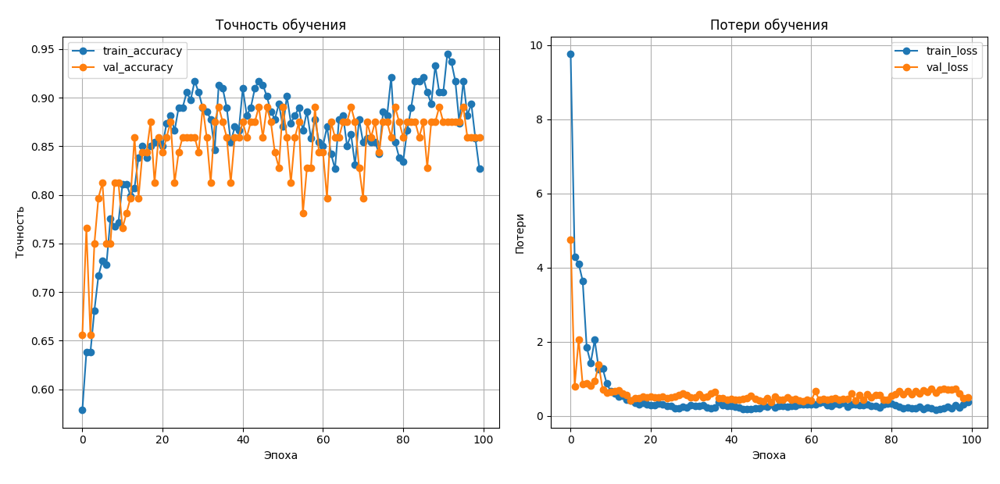

# Компьютерное зрение и нейронные сети / Computer Vision & Neural Networks

> Серия лабораторных работ по обработке изображений, видео и классификации с использованием OpenCV и TensorFlow/Keras.
>
> A series of laboratory works on image processing, video analysis, and classification using OpenCV and TensorFlow/Keras.

---

## 📋 Обзор / Overview

| Лабораторная | Тема / Topic | Технологии / Technologies |
|--------------|--------------|---------------------------|
| [Lab 1](lab1/) | Обработка изображений и видео с OpenCV / Image & Video Processing with OpenCV | OpenCV, NumPy, Pillow |
| [Lab 2](lab2/) | Полносвязная нейронная сеть (FFNN) / Feed-Forward Neural Network | TensorFlow, Keras, scikit-learn |
| [Lab 3](lab3/) | Свёрточная нейронная сеть (CNN) / Convolutional Neural Network | TensorFlow, Keras, Data Augmentation |

---

## 🇷🇺 Русская версия

### Lab 1 — Обработка изображений и видео с OpenCV

Обработка изображений листьев растений для обнаружения болезней и детекция объектов в видео по HSV-маске.

**Ключевые компоненты:**
- **Scan_PV_OpenCV.py** — выделение больных областей на листьях по цветовым признакам (HSV-маски)
- **mask_video_detector.py** — детекция объектов в видео с несколькими режимами маски
- **classifier.py** — GUI-приложение для классификации изображений

**Примеры обработки изображений:**

| Исходное изображение | Результат обработки |
|----------------------|---------------------|
|  |  |
|  |  |
|  |  |
|  |  |
|  |  |
|  |  |

[Подробнее →](lab1/)

---

### Lab 2 — Полносвязная нейронная сеть (FFNN)

Обучение FFNN для классификации изображений на два класса: **медведь** и **бинокль** (датасет Caltech-256).

**Архитектура:**
```
Dense(512) → Dropout(0.4) → Dense(256) → Dropout(0.3) → Dense(128) → Dense(2, softmax)
```

**Графики обучения:**



[Подробнее →](lab2/)

---

### Lab 3 — Свёрточная нейронная сеть (CNN)

Обучение CNN с аугментацией данных для той же задачи классификации.

**Архитектура:**
```
Conv2D(32) → MaxPool → Conv2D(64) → MaxPool → Conv2D(128) → MaxPool → Flatten → Dense(128) → Dropout(0.5) → Dense(2, softmax)
```

**Сравнение FFNN и CNN:**

| Параметр | Lab 2 (FFNN) | Lab 3 (CNN) |
|----------|--------------|-------------|
| Тип сети | Полносвязная | Свёрточная |
| Вход | Flatten вектор (30000) | 3D тензор (100, 100, 3) |
| Аугментация | Нет | Да |
| Извлечение признаков | Автоматическое (плоское) | Пространственное (свёртки) |

[Подробнее →](lab3/)

---

## 🇬🇧 English Version

### Lab 1 — Image & Video Processing with OpenCV

Processing of plant leaf images for disease detection and object detection in video using HSV masks.

**Key components:**
- **Scan_PV_OpenCV.py** — highlights diseased areas on leaves using color-based HSV masks
- **mask_video_detector.py** — video object detection with multiple mask modes
- **classifier.py** — GUI application for image classification

**Image processing examples:**

| Original image | Processed result |
|----------------|------------------|
|  |  |
|  |  |
|  |  |
|  |  |
|  |  |
|  |  |

[Read more →](lab1/)

---

### Lab 2 — Feed-Forward Neural Network (FFNN)

Training an FFNN to classify images into two classes: **bear** and **binoculars** (Caltech-256 dataset).

**Architecture:**
```
Dense(512) → Dropout(0.4) → Dense(256) → Dropout(0.3) → Dense(128) → Dense(2, softmax)
```

**Training charts:**


[Read more →](lab2/)

---

### Lab 3 — Convolutional Neural Network (CNN)

Training a CNN with data augmentation for the same classification task.

**Architecture:**
```
Conv2D(32) → MaxPool → Conv2D(64) → MaxPool → Conv2D(128) → MaxPool → Flatten → Dense(128) → Dropout(0.5) → Dense(2, softmax)
```

**FFNN vs CNN comparison:**

| Parameter | Lab 2 (FFNN) | Lab 3 (CNN) |
|-----------|--------------|-------------|
| Network type | Fully-connected | Convolutional |
| Input | Flatten vector (30000) | 3D tensor (100, 100, 3) |
| Augmentation | No | Yes |
| Feature extraction | Automatic (flat) | Spatial (convolutions) |

[Read more →](lab3/)

---

## Установка зависимостей / Dependencies

```bash
pip install opencv-python numpy Pillow tensorflow scikit-learn matplotlib
```

## Структура проекта / Project Structure

```
.
├── lab1/              # OpenCV обработка изображений и видео
├── lab2/              # FFNN классификация
├── lab3/              # CNN классификация
└── README.md          # Этот файл
```
