# Lab 1 — Обработка изображений и видео с OpenCV

## Описание

Лабораторная работа посвящена обработке изображений и видео с использованием библиотеки OpenCV. Реализованы три инструмента:

1. **Scan_PV_OpenCV.py** — пакетная обработка изображений листьев растений для обнаружения признаков болезней
2. **mask_video_detector.py** — детекция объектов в видео по HSV-маске
3. **classifier.py** — GUI-приложение для классификации изображений (медведь/бинокль) с использованием моделей FFNN и CNN

## Структура проекта

```
lab1/
├── Scan_PV_OpenCV.py       # Обработка изображений растений
├── mask_video_detector.py  # Детекция объектов в видео
├── classifier.py           # GUI-классификатор
├── images/                 # Входные изображения (6 шт.)
│   ├── 1.jpg
│   ├── 2.jpg
│   ├── 3.jpg
│   ├── 4.jpg
│   ├── 5.jpg
│   └── 6.jpg
├── output/                 # Результаты обработки изображений
├── output_video/           # Результаты обработки видео
│   └── 1_processed_20260331_200838.mp4
└── 1.mp4                   # Исходное видео
```

## Компоненты

### 1. Scan_PV_OpenCV.py — Детекция болезней растений

Обрабатывает изображения листьев и выделяет подозрительные области по цветовым признакам в HSV-пространстве:

- Белые/светлые пятна (вирусная мозаика)
- Светло-желтые пятна
- Желто-коричневые пятна
- Черные/темные пятна
- Коричневые участки

**Алгоритм:**
1. Размытие изображения (GaussianBlur)
2. Конвертация в HSV
3. Построение нескольких масок по цветовым диапазонам
4. Объединение масок и морфологическая очистка
5. Поиск контуров и фильтрация по площади и соотношению сторон
6. Отрисовка результатов и сохранение

### 2. mask_video_detector.py — Детекция объектов в видео

Обрабатывает видеофайл в реальном времени, обнаруживая объекты по HSV-маске.

**Режимы:**
- Одиночная маска (белые/желтые пятна)
- Комбинированная маска для всех типов болезней
- Ручной ввод параметров HSV

**Возможности:**
- Отображение оригинала, маски и результата в отдельных окнах
- Подсчёт обнаруженных объектов
- Сохранение обработанного видео
- Пауза по клавише `p`, выход по `q`

### 3. classifier.py — GUI-классификатор

Приложение на tkinter для классификации изображений с использованием предобученных моделей.

**Модели:**
- FFNN (полносвязная сеть) — `.keras`
- CNN (свёрточная сеть) — `.h5`

**Функции:**
- Выбор и предпросмотр изображения
- Классификация с отображением вероятностей
- Визуальные прогресс-бары для каждого класса
- Порог уверенности 50%
- Сохранение аннотированного результата

## Примеры обработки

| Исходное изображение | Результат обработки |
|----------------------|---------------------|
| 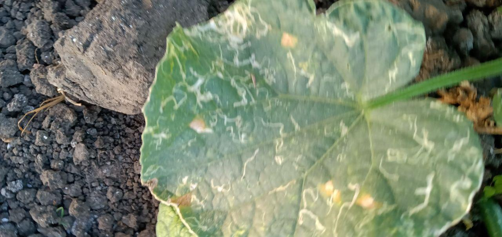 | 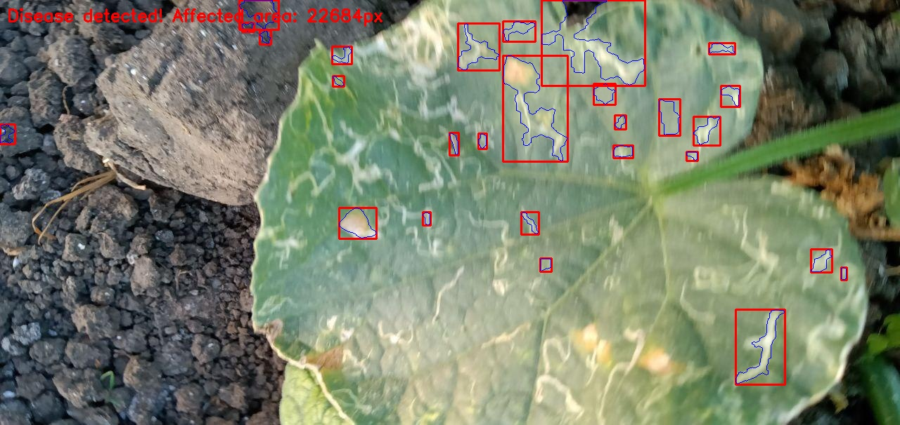 |
| 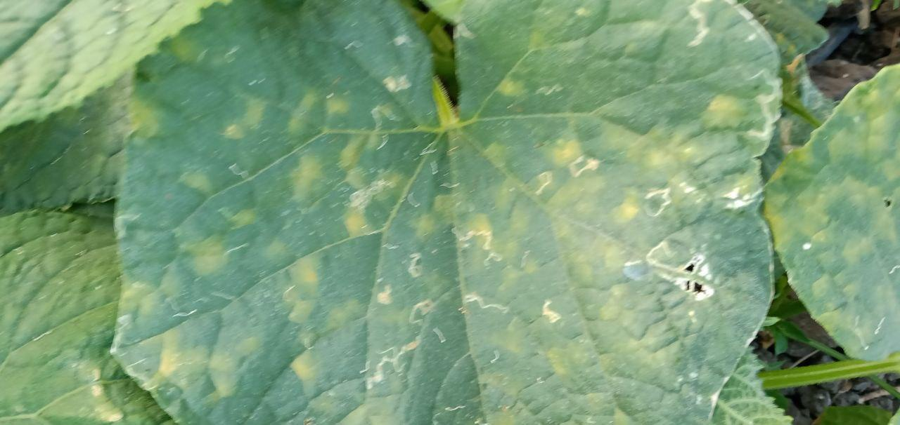 | 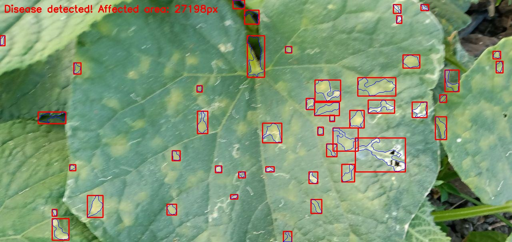 |
| 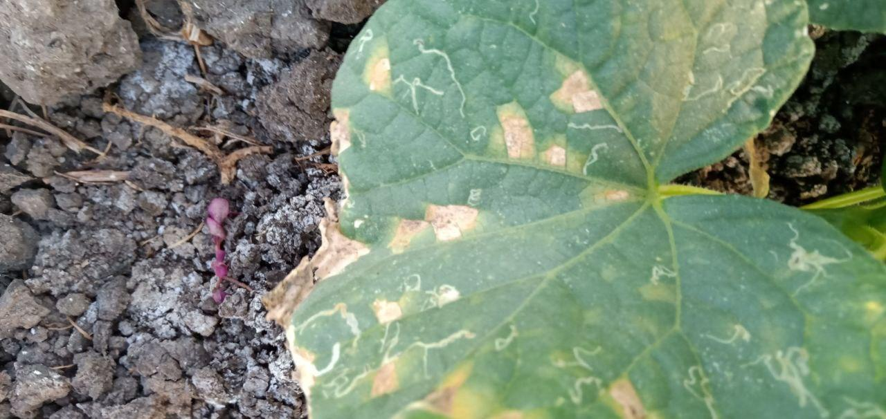 | 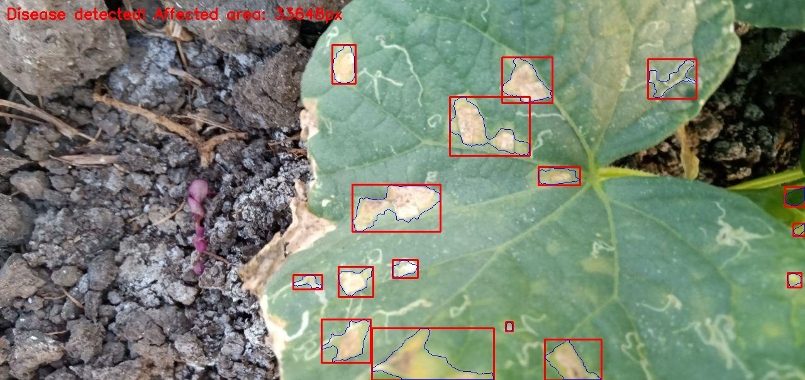 |
| 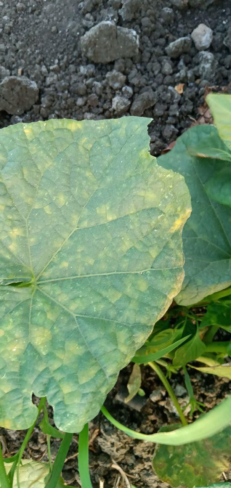 | 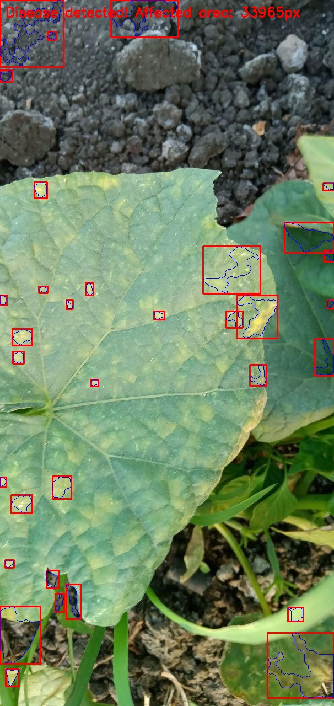 |
| 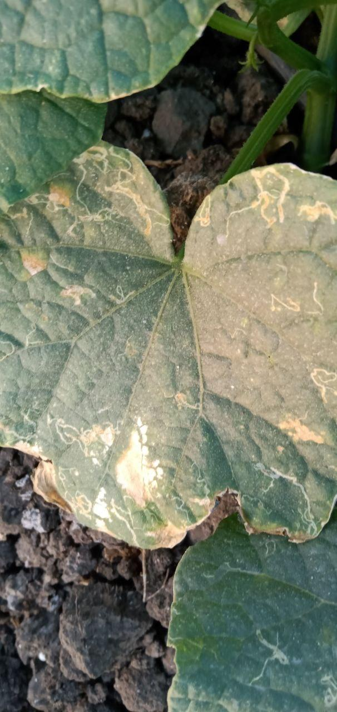 | 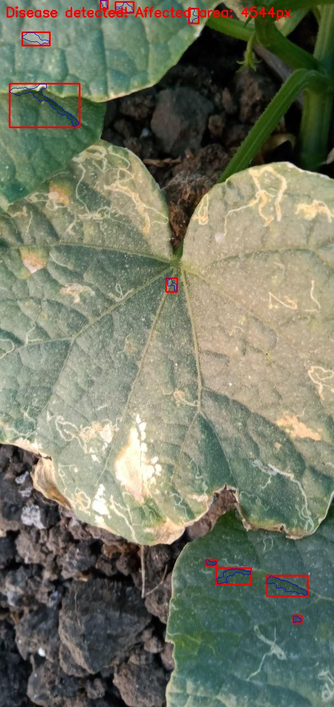 |
| 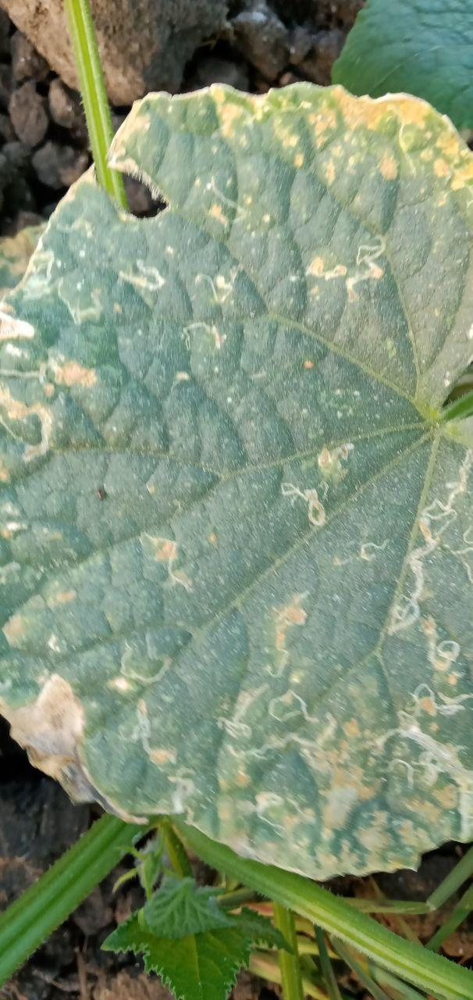 | 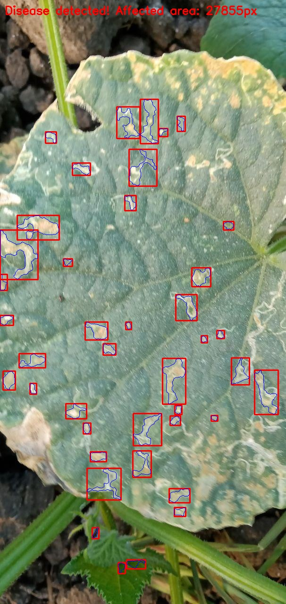 |

## Зависимости

```bash
pip install opencv-python numpy Pillow tensorflow
```

## Запуск

```bash
# Обработка изображений растений
python Scan_PV_OpenCV.py

# Детекция объектов в видео
python mask_video_detector.py

# GUI-классификатор
python classifier.py
```
